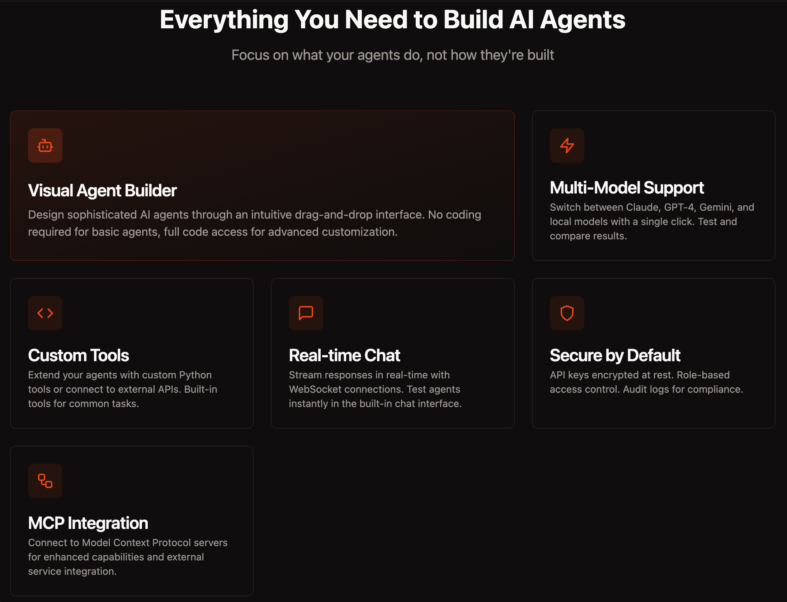

<div align="center">
    
# Strands GUI


[](https://www.buymeacoffee.com/muscl3n3rd)

A comprehensive web-based GUI for the [Strands Agents SDK](https://github.com/strands-agents/sdk-python) that allows users to build, configure, and run AI agents without writing code.

[Demo](https://strands.ai-sherpa.rocks) • [Screenshots](#screenshots) • [Features](#features) • [Quick Start](#quick-start) • [API Docs](#api-documentation)

</div>

## Screenshots

Strands GUI Landing Page





## Features

- **User Authentication**: Secure JWT-based authentication with registration and login
- **Dashboard**: Overview of all agents with quick actions and statistics
- **Agent Builder**: Intuitive wizard-based interface for creating and configuring agents
- **Multi-Provider Support**: Support for multiple AI model providers:
  - Amazon Bedrock
  - Google Gemini
  - OpenAI
  - Anthropic
  - Ollama (local)
- **Tool Integration**: Built-in tools from strands-agents-tools and custom Python tools
- **Real-time Chat**: WebSocket-based chat interface with streaming responses
- **API Keys Management**: Secure storage and management of provider credentials
- **Dark/Light Mode**: Automatic theme detection with manual toggle

## Tech Stack

### Backend
- **FastAPI** - High-performance async API framework
- **SQLAlchemy** - Async ORM with PostgreSQL
- **Strands Agents SDK** - AI agent framework
- **JWT** - Secure authentication
- **WebSocket** - Real-time streaming

### Frontend
- **React 18** - UI framework
- **TypeScript** - Type safety
- **Vite** - Build tool
- **Tailwind CSS** - Styling
- **Radix UI** - Accessible components
- **React Router** - Navigation

### Infrastructure
- **PostgreSQL** - Database
- **Redis** - Caching and sessions
- **Docker** - Containerization
- **Nginx** - Reverse proxy

## Quick Start

### Prerequisites
- Docker and Docker Compose v2
- Git

### Installation

1. Clone the repository:
```bash
git clone https://github.com/yourusername/strands-gui.git
cd strands-gui
```

2. Create environment file:
```bash
cp .env.example .env
```

3. Edit `.env` with your configuration:
```bash
# Generate a secure JWT secret
openssl rand -hex 32

# Add your API keys for the providers you want to use
```

4. Start the application:
```bash
docker compose up -d --build
```

5. Access the application at: **http://localhost:58431**

### Default Port
The application runs on port **58431** by default.

## Configuration

### Environment Variables

| Variable | Description | Default |
|----------|-------------|---------|
| `DB_NAME` | PostgreSQL database name | `strands_gui` |
| `DB_USER` | PostgreSQL username | `strands` |
| `DB_PASSWORD` | PostgreSQL password | - |
| `JWT_SECRET` | Secret key for JWT tokens | - |
| `DOMAIN_NAME` | Custom domain name (e.g., `strands.example.com`) | - |
| `USE_HTTPS` | Set to `true` if domain uses HTTPS | `false` |
| `CORS_ORIGINS` | Allowed CORS origins | `http://localhost:58431` |
| `AWS_ACCESS_KEY_ID` | AWS credentials for Bedrock | - |
| `AWS_SECRET_ACCESS_KEY` | AWS credentials for Bedrock | - |
| `OPENAI_API_KEY` | OpenAI API key | - |
| `ANTHROPIC_API_KEY` | Anthropic API key | - |
| `GEMINI_API_KEY` | Google Gemini API key | - |

### Custom Domain Setup

Strands GUI supports deployment with a custom domain name, making it easy to use with reverse proxies like Cloudflare Tunnels, Nginx, or Traefik.

#### Using Cloudflare Tunnels

1. Configure your `.env` file with the domain:
```bash
DOMAIN_NAME=strands.yourdomain.com
USE_HTTPS=true
```

2. Start the application:
```bash
docker compose up -d --build
```

3. In your Cloudflare Tunnel configuration, point the domain to:
   - **Service**: `http://localhost:58431`
   - Or if running in Docker: `http://strands-gui-frontend:80`

4. The application will automatically:
   - Add your domain to the CORS allowed origins
   - Accept requests from your custom domain

#### Using Other Reverse Proxies

For Nginx, Traefik, or other reverse proxies:

1. Set the domain in `.env`:
```bash
DOMAIN_NAME=strands.yourdomain.com
USE_HTTPS=true  # Set to true if your proxy handles SSL
```

2. Configure your reverse proxy to forward requests to `localhost:58431`

3. Ensure WebSocket support is enabled for the `/api/ws` path

Example Nginx configuration:
```nginx
server {
    listen 443 ssl;
    server_name strands.yourdomain.com;

    location / {
        proxy_pass http://localhost:58431;
        proxy_http_version 1.1;
        proxy_set_header Upgrade $http_upgrade;
        proxy_set_header Connection "upgrade";
        proxy_set_header Host $host;
        proxy_set_header X-Real-IP $remote_addr;
        proxy_set_header X-Forwarded-For $proxy_add_x_forwarded_for;
        proxy_set_header X-Forwarded-Proto $scheme;
    }
}
```

## Usage

### Creating an Agent

1. Navigate to **Agents** → **New Agent**
2. Fill in the basic information (name, description)
3. Select a model provider and model
4. Configure parameters (temperature, max tokens)
5. Select tools for the agent to use
6. Write a system prompt
7. Save and test your agent

### Running an Agent

1. Click on an agent card to open it
2. Click **Run** to start a chat session
3. Type your message and press Enter
4. View streaming responses in real-time

### Managing API Keys

1. Navigate to **API Keys**
2. Click **Add API Key**
3. Select provider and enter credentials
4. Keys are securely encrypted in the database

## Development

### Local Development

Backend:
```bash
cd backend
python -m venv venv
source venv/bin/activate
pip install -r requirements.txt
uvicorn app.main:app --reload --port 58431
```

Frontend:
```bash
cd frontend
npm install
npm run dev
```

### Project Structure

```
strands-gui/
├── backend/
│   ├── app/
│   │   ├── api/routes/      # API endpoints
│   │   ├── core/            # Config, DB, security
│   │   ├── models/          # SQLAlchemy models
│   │   ├── schemas/         # Pydantic schemas
│   │   ├── services/        # Business logic
│   │   └── main.py          # FastAPI app
│   ├── Dockerfile
│   └── requirements.txt
├── frontend/
│   ├── src/
│   │   ├── components/      # UI components
│   │   ├── contexts/        # React contexts
│   │   ├── hooks/           # Custom hooks
│   │   ├── pages/           # Page components
│   │   ├── services/        # API client
│   │   └── types/           # TypeScript types
│   ├── Dockerfile
│   └── nginx.conf
├── agents/                  # SDK Auto-Update Agents
│   ├── tools/               # Custom tools for agents
│   ├── orchestrator.py      # Main coordinator
│   ├── sdk_monitor.py       # Version monitoring
│   ├── changelog_analyzer.py # Release analysis
│   ├── code_updater.py      # Git operations
│   ├── test_runner.py       # Test execution
│   └── pr_manager.py        # PR automation
├── .github/workflows/       # CI/CD pipelines
├── docker-compose.yml
└── README.md
```

## API Documentation

Once running, access the API documentation at:
- Swagger UI: http://localhost:58431/api/docs
- ReDoc: http://localhost:58431/api/redoc

## SDK Auto-Update System

Strands GUI includes a self-maintaining agent system that automatically monitors and updates the Strands SDK dependency. This demonstrates the power of Strands Agents by using agents to maintain their own GUI.

### Architecture

```
┌─────────────────────────────────────────────────────────────┐
│                GitHub Actions (Scheduler)                    │
│                Runs daily at 00:00 UTC                      │
└─────────────────────────────────────────────────────────────┘
                              │
                              ▼
┌─────────────────────────────────────────────────────────────┐
│                  SDK Monitor Agent                           │
│  • Checks PyPI/GitHub for new strands-agents versions       │
│  • Compares with current requirements.txt                   │
└─────────────────────────────────────────────────────────────┘
                              │
                              ▼
┌─────────────────────────────────────────────────────────────┐
│               Changelog Analyzer Agent                       │
│  • Fetches release notes from GitHub                        │
│  • Categorizes changes (breaking, features, fixes)          │
│  • Assesses risk level (low/medium/high)                    │
└─────────────────────────────────────────────────────────────┘
                              │
                              ▼
┌─────────────────────────────────────────────────────────────┐
│                 Code Updater Agent                           │
│  • Creates feature branch                                   │
│  • Updates requirements.txt                                 │
│  • Commits changes                                          │
└─────────────────────────────────────────────────────────────┘
                              │
                              ▼
┌─────────────────────────────────────────────────────────────┐
│                 Test Runner Agent                            │
│  • Runs unit tests and SDK compatibility tests              │
│  • Validates Docker builds                                  │
│  • Reports test results                                     │
└─────────────────────────────────────────────────────────────┘
                              │
                              ▼
┌─────────────────────────────────────────────────────────────┐
│                  PR Manager Agent                            │
│  • Creates pull request with changelog                      │
│  • Auto-merges if tests pass and no breaking changes        │
│  • Requests review for high-risk updates                    │
└─────────────────────────────────────────────────────────────┘
```

### Running the Orchestrator Manually

```bash
# Check for SDK updates
python agents/orchestrator.py check-version

# Run full update workflow
python agents/orchestrator.py update --repo your-org/strands-gui

# Dry run (no push/PR)
python agents/orchestrator.py update --repo your-org/strands-gui --dry-run

# Force update even if on latest version
python agents/orchestrator.py update --repo your-org/strands-gui --force
```

### GitHub Actions Workflows

| Workflow | Trigger | Description |
|----------|---------|-------------|
| `test.yml` | Push/PR | Runs test suite on all branches |
| `sdk-update.yml` | Daily (00:00 UTC) | Checks for SDK updates and creates PRs |
| `release.yml` | Push to main | Creates releases and publishes Docker images |

### Required Secrets

For the auto-update system to work, configure these GitHub repository secrets:

- `GITHUB_TOKEN` - Auto-provided by GitHub Actions
- `AWS_ACCESS_KEY_ID` - For Bedrock tests (optional)
- `AWS_SECRET_ACCESS_KEY` - For Bedrock tests (optional)

## Testing

### Running Tests Locally

```bash
cd backend

# Install dev dependencies
pip install -r requirements-dev.txt

# Run all tests
pytest tests/ -v

# Run only unit tests
pytest tests/ -v -m unit

# Run SDK compatibility tests
pytest tests/ -v -m sdk

# Run with coverage
pytest tests/ --cov=app --cov-report=html
```

### Test Categories

- **Unit tests** (`-m unit`): Fast tests with mocked dependencies
- **Integration tests** (`-m integration`): Tests with database and services
- **SDK tests** (`-m sdk`): Strands SDK compatibility tests

## License

MIT License

---

[](https://linkedin.com/in/joe-leboube)


